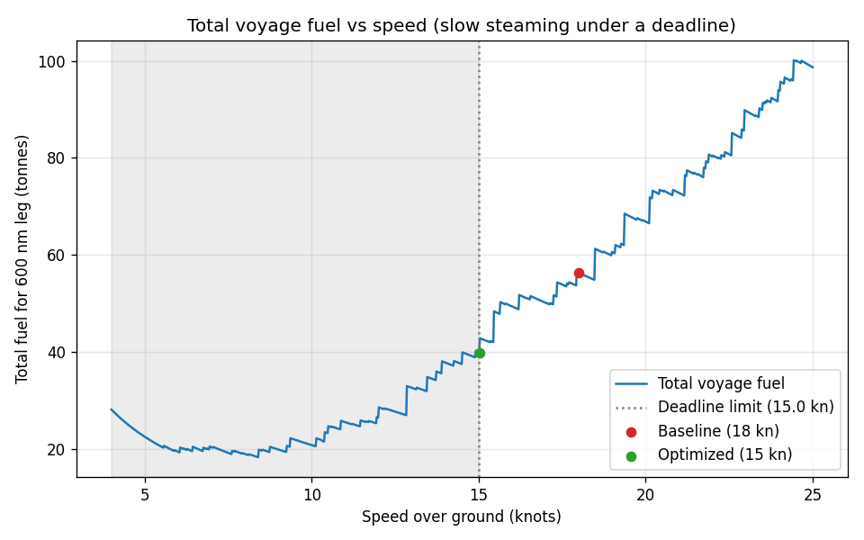
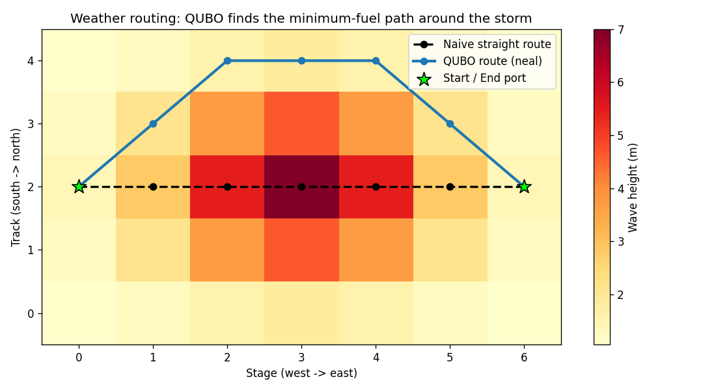

# Maritime Fuel Efficiency Optimization — Prototype

**Indian Coast Guard — Problem Statement 77: "Fuel consumption optimization using
AI-based tools."**

A working prototype that **predicts a ship's fuel-burn rate** from static (vessel
design) + dynamic (voyage) data, then uses a **quantum-inspired optimizer**
(simulated annealing) to recommend the **fuel-minimizing speed that still meets
the arrival deadline** — i.e. data-driven *slow steaming*. CO₂ savings are
reported too, for IMO/environmental compliance.

> **Phase 1 (prediction + slow-steaming speed optimization) and Phase 2
> (genuine QUBO optimizers — speed + weather routing) are DONE and run today.**
> Phase 3 (dashboard) is planned — see the roadmap.

---

## Quick start

```bash
pip install -r requirements.txt   # numpy, pandas, scikit-learn, joblib, matplotlib
py demo.py                        # runs the whole pipeline + saves a plot
```

`demo.py` generates data → trains & compares models → optimizes speed for two
voyage scenarios → saves `outputs/voyage_fuel_vs_speed.png`.

Run stages individually:

```bash
py generate_data.py --n 10000 --seed 42                 # -> data/ship_fuel_data.csv
py train_model.py                                        # -> models/ship_fuel_model.joblib
py optimizer.py --distance 600 --deadline 80 --waves 4 --wind 30
```

---

## Why ships are different from cars (the modelling insight)

- **Cubic speed–power law.** A ship's fuel *rate* (tonnes/day) grows with the
  **cube of speed** (`power ~ displacement^(2/3) × speed³`). So minimizing fuel
  alone trivially says "go as slow as possible".
- **The real problem is constrained.** Operationally you must **arrive on time**.
  So we minimize *total voyage fuel* `= rate(speed) × distance / (24 × speed)`
  subject to a **deadline** (`speed ≥ distance / deadline`). Because the ship
  also burns a speed-independent **hotel/auxiliary load**, the total-fuel curve
  is **U-shaped** — there is an "economic speed". This is exactly the real-world
  practice of **slow steaming**.
- **Environment matters.** Sea state (wave height), wind, current
  (speed-through-water vs over-ground), and load condition all change fuel burn.

---

## What's in here

| File | Role | Report § |
|------|------|----------|
| `config.py` | Feature schema, ship classes, voyage + emission constants | §3 |
| `generate_data.py` | Physics-based ship-voyage simulator (cubic law) | §4 |
| `train_model.py` | Linear / Random Forest / Gradient Boosting + metrics | §6 |
| `optimizer.py` | Simulated-annealing slow-steaming optimizer (+ CO₂) | §7 |
| `demo.py` | One-command end-to-end demonstration | §12 |
| `qubo_speed.py` | **Phase 2a:** speed optimization as a QUBO (pyqubo + neal) | §7 |
| `qubo_route.py` | **Phase 2b:** weather routing as a QUBO (the headline) | §7 |

Ship classes modeled (ICG-style patrol fleet): **Interceptor**, **Fast Patrol**,
**Offshore Patrol Vessel**. Generated at runtime: `data/`, `models/`, `outputs/`.

---

## Phase 1 results (from `py demo.py`)

**Model comparison** — predicting fuel rate (t/day), 20% held-out test + 5-fold CV:

| Model | CV R² | Test R² | MAE | RMSE | MAPE |
|-------|------:|--------:|----:|-----:|-----:|
| **Gradient Boosting** | 0.987 | **0.987** | 1.30 | 2.45 | 11.3% |
| Random Forest | 0.977 | 0.980 | 1.52 | 3.06 | 9.3% |
| Linear Regression | 0.641 | 0.648 | 9.10 | 12.97 | 354% |

The linear baseline **fails badly** (R² 0.65, MAPE 354%) — it cannot represent the
cubic law across vessels spanning ~5 to ~90 t/day. Gradient boosting nails it
(R² ≈ 0.99). This is a strong illustration of *why* nonlinear models are needed.

**Optimization** — Offshore Patrol Vessel, 600 nm leg, baseline = 18 kn service speed:

| Scenario | Optimal speed | Fuel | vs baseline | CO₂ saved |
|----------|--------------:|-----:|------------:|----------:|
| Tight schedule (40 h) | 15.0 kn (deadline-bound) | 39.9 t | **−29%** | 52.5 t |
| Relaxed schedule (90 h) | 8.4 kn (economic speed) | 18.3 t | **−68%** | 121.8 t |

In both cases simulated annealing matched the brute-force grid optimum to within
**0.01 kn**, proving it found the true optimum.



*The U-shaped curve is total voyage fuel. The grey region is too slow to meet the
deadline; the optimizer (green) picks the slowest feasible speed, well below the
habitual baseline (red).*

---

## Phase 2 results — genuine "quantum-inspired" QUBO

The optimization is reformulated as a **QUBO** (Quadratic Unconstrained Binary
Optimization) — the exact Ising/binary form a **D-Wave quantum annealer** solves
natively — and solved classically with `neal`. The *same QUBO* could be submitted
to real quantum hardware unchanged; that portability is what makes it
"quantum-inspired". Constraints (pick one option, meet the deadline, no illegal
moves) are encoded as **penalty terms**, the standard QUBO technique.

**Phase 2a — speed as a QUBO** (`py qubo_speed.py`): one-hot encode candidate
speeds, solve with neal. It lands on the same speed as Phase 1's SA/grid (within
the discretization step), proving the QUBO machinery is correct.

**Phase 2b — weather routing as a QUBO** (`py qubo_route.py`): the real headline.
A ship crosses a weather field; each grid cell's fuel cost comes from the **Phase 1
ML model**. The QUBO picks the minimum-fuel path *around* the storm:

| Route | Fuel (t) | Note |
|-------|---------:|------|
| Naive straight line (through storm) | 58.3 | what a captain does by default |
| **QUBO route (neal)** | **52.7** | **−9.6%** — detours around the storm |
| Brute-force optimum | 52.7 | matches QUBO (equal fuel) ✓ |



*The QUBO (blue) routes around the high-wave storm (dark red); the naive route
(black) plows straight through it. A centred storm has two equal optima
(north/south) — the QUBO found one, brute force the other, both 52.7 t.*

---

## The story for the demo (30 seconds)

> *"We simulate Coast Guard voyage data from real naval-architecture physics —
> the cubic speed–power law. A gradient-boosting model rediscovers it from noisy
> data at R² ≈ 0.99. Then a quantum-inspired annealer recommends the slowest
> speed that still meets the mission deadline — cutting fuel up to ~30% on a tight
> schedule and far more when the schedule allows, with the CO₂ savings reported
> for IMO compliance. We verify the annealer found the true optimum against brute
> force."*

**Honest caveats** (good to state up front): the physics coefficients are
plausible but not calibrated to a specific vessel; data is synthetic; the QUBO is
solved on a *classical* annealer (`neal`), not real quantum hardware — but the
formulation is hardware-portable.

---

## Roadmap

- **Phase 1 — DONE:** synthetic ship data → fuel-rate model (R² ≈ 0.99) →
  slow-steaming SA optimizer with deadline + CO₂, one-command demo + plot.
- **Phase 2 — DONE:** genuine **QUBO** optimizers (PyQUBO + dwave-neal) for both
  speed (2a) and **weather routing** (2b), validated against brute force. The same
  QUBOs are portable to real D-Wave quantum hardware.
- **Phase 3 — Dashboard:** Streamlit UI — pick ship + conditions + voyage,
  see predicted fuel, click "Optimize", get the recommended speed/route + savings.

### Possible Phase 2+ extensions
- Multi-segment speed profile (a speed per leg under a total-time deadline).
- Joint speed **and** route optimization in one QUBO.
- Genetic-algorithm optimizer for a three-way comparison (SA vs GA vs QUBO).
- Retrain the model on a real public dataset (e.g. FuelCast) to show transfer.
