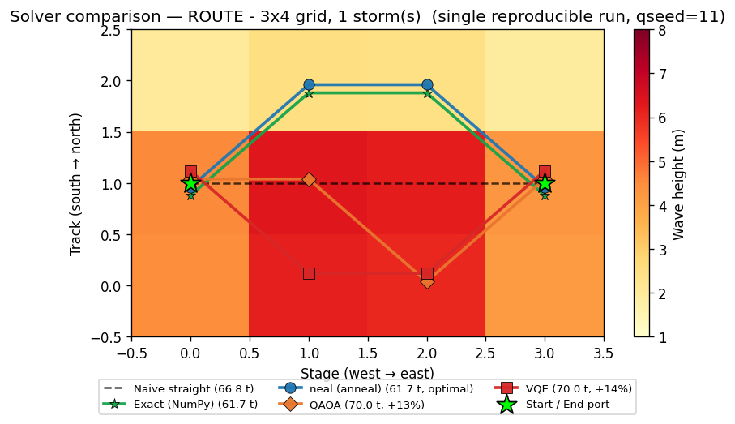

# Maritime Fuel Efficiency Optimization — Prototype

**Indian Coast Guard — Problem Statement 77: "Fuel consumption optimization using
AI-based tools."**

A working prototype that **predicts a ship's fuel-burn rate** from static (vessel
design) + dynamic (voyage) data, then uses a **quantum-inspired optimizer**
(simulated annealing) to recommend the **fuel-minimizing speed that still meets
the arrival deadline** — i.e. data-driven *slow steaming*. CO₂ savings are
reported too, for IMO/environmental compliance.

> **Phase 1 (prediction + slow-steaming speed optimization) and Phase 2
> (genuine QUBO optimizers — speed + weather routing) are DONE and run today.**
> Phase 3 (dashboard) is planned — see the roadmap.

---

## Quick start

```bash
pip install -r requirements.txt   # numpy, pandas, scikit-learn, joblib, matplotlib
py demo.py                        # runs the whole pipeline + saves a plot
```

`demo.py` generates data → trains & compares models → optimizes speed for two
voyage scenarios → saves `outputs/voyage_fuel_vs_speed.png`.

Run stages individually:

```bash
py generate_data.py --n 10000 --seed 42                 # -> data/ship_fuel_data.csv
py train_model.py                                        # -> models/ship_fuel_model.joblib
py optimizer.py --distance 600 --deadline 80 --waves 4 --wind 30
```

---

## Why ships are different from cars (the modelling insight)

- **Cubic speed–power law.** A ship's fuel *rate* (tonnes/day) grows with the
  **cube of speed** (`power ~ displacement^(2/3) × speed³`). So minimizing fuel
  alone trivially says "go as slow as possible".
- **The real problem is constrained.** Operationally you must **arrive on time**.
  So we minimize *total voyage fuel* `= rate(speed) × distance / (24 × speed)`
  subject to a **deadline** (`speed ≥ distance / deadline`). Because the ship
  also burns a speed-independent **hotel/auxiliary load**, the total-fuel curve
  is **U-shaped** — there is an "economic speed". This is exactly the real-world
  practice of **slow steaming**.
- **Environment matters.** Sea state (wave height), wind, current
  (speed-through-water vs over-ground), and load condition all change fuel burn.

---

## What's in here

| File | Role | Report § |
|------|------|----------|
| `config.py` | Feature schema, ship classes, voyage + emission constants | §3 |
| `generate_data.py` | Physics-based ship-voyage simulator (cubic law) | §4 |
| `train_model.py` | Linear / Random Forest / Gradient Boosting + metrics | §6 |
| `optimizer.py` | Simulated-annealing slow-steaming optimizer (+ CO₂) | §7 |
| `demo.py` | One-command end-to-end demonstration | §12 |
| `qubo_speed.py` | **Phase 2a:** speed optimization as a QUBO (pyqubo + neal) | §7 |
| `qubo_route.py` | **Phase 2b:** weather routing as a QUBO (the headline) | §7 |
| `backends.py` | Solver swap point: `neal` / `dwave` (real QPU) / `tabu` | §7 |
| `quantum_gate.py` | **Phase 2c:** the same QUBO on gate-model **QAOA + VQE** (Qiskit) | §7 |

Ship classes modeled (ICG-style patrol fleet): **Interceptor**, **Fast Patrol**,
**Offshore Patrol Vessel**. Generated at runtime: `data/`, `models/`, `outputs/`.

---

## Phase 1 results (from `py demo.py`)

**Model comparison** — predicting fuel rate (t/day), 20% held-out test + 5-fold CV:

| Model | CV R² | Test R² | MAE | RMSE | MAPE |
|-------|------:|--------:|----:|-----:|-----:|
| **Gradient Boosting** | 0.987 | **0.987** | 1.30 | 2.45 | 11.3% |
| Random Forest | 0.977 | 0.980 | 1.52 | 3.06 | 9.3% |
| Linear Regression | 0.641 | 0.648 | 9.10 | 12.97 | 354% |

The linear baseline **fails badly** (R² 0.65, MAPE 354%) — it cannot represent the
cubic law across vessels spanning ~5 to ~90 t/day. Gradient boosting nails it
(R² ≈ 0.99). This is a strong illustration of *why* nonlinear models are needed.

**Optimization** — Offshore Patrol Vessel, 600 nm leg, baseline = 18 kn service speed:

| Scenario | Optimal speed | Fuel | vs baseline | CO₂ saved |
|----------|--------------:|-----:|------------:|----------:|
| Tight schedule (40 h) | 15.0 kn (deadline-bound) | 39.9 t | **−29%** | 52.5 t |
| Relaxed schedule (90 h) | 8.4 kn (economic speed) | 18.3 t | **−68%** | 121.8 t |

In both cases simulated annealing matched the brute-force grid optimum to within
**0.01 kn**, proving it found the true optimum.


*The U-shaped curve is total voyage fuel. The grey region is too slow to meet the
deadline; the optimizer (green) picks the slowest feasible speed, well below the
habitual baseline (red).*

---

## Phase 2 results — genuine "quantum-inspired" QUBO

The optimization is reformulated as a **QUBO** (Quadratic Unconstrained Binary
Optimization) — the exact Ising/binary form a **D-Wave quantum annealer** solves
natively — and solved classically with `neal`. The *same QUBO* could be submitted
to real quantum hardware unchanged; that portability is what makes it
"quantum-inspired". Constraints (pick one option, meet the deadline, no illegal
moves) are encoded as **penalty terms**, the standard QUBO technique.

**Phase 2a — speed as a QUBO** (`py qubo_speed.py`): one-hot encode candidate
speeds, solve with neal. It lands on the same speed as Phase 1's SA/grid (within
the discretization step), proving the QUBO machinery is correct.

**Phase 2b — weather routing as a QUBO** (`py qubo_route.py`): the real headline.
A ship crosses a weather field; each grid cell's fuel cost comes from the **Phase 1
ML model**. The QUBO picks the minimum-fuel path *around* the storm:

| Route | Fuel (t) | Note |
|-------|---------:|------|
| Naive straight line (through storm) | 58.3 | what a captain does by default |
| **QUBO route (neal)** | **52.7** | **−9.6%** — detours around the storm |
| Brute-force optimum | 52.7 | matches QUBO (equal fuel) ✓ |


*The QUBO (blue) routes around the high-wave storm (dark red); the naive route
(black) plows straight through it. A centred storm has two equal optima
(north/south) — the QUBO found one, brute force the other, both 52.7 t.*

### Swappable solver backends (`backends.py`)

The same QUBO can be handed to different solvers with `--backend`:

| Backend | What it is | Needs |
|---------|-----------|-------|
| `neal` (default) | Classical simulated annealing | nothing — offline |
| `tabu` | Classical Tabu search | nothing — offline |
| `dwave` | **Real D-Wave quantum annealer** via Leap | a Leap API token |

```bash
py qubo_route.py --rows 5 --cols 7 --backend tabu
py qubo_route.py --rows 5 --cols 7 --backend dwave   # needs a Leap token
```

> **Note on `dwave`:** D-Wave's free *Trial* plan now allows demos only — it no
> longer issues API tokens for submitting your own problems. Running our QUBO on a
> real annealer needs a paid/commercial or academic Leap plan. The code path is
> ready; it's a one-flag switch if/when access is granted.

### Phase 2c — the same QUBO on gate-model quantum (QAOA + VQE)

`quantum_gate.py` proves the QUBO is portable to **gate-model** quantum computers
(IBM-style), not just annealers. It converts the QUBO → an Ising Hamiltonian and
solves it with **QAOA** and **VQE** on Qiskit's free local simulator (the same
code runs on real IBM hardware via the free Open plan).

```bash
py quantum_gate.py --problem speed --levels 8          # 8 qubits
py quantum_gate.py --problem route --rows 3 --cols 4 --storms 1 --seed 2
```

| Problem | Qubits | QAOA | VQE | vs exact |
|---------|-------:|------|-----|----------|
| Speed (8 levels) | 8 | 16.0 kn ✓ | 16.0 kn ✓ | **both match exactly** |
| Route (3×4, 1 storm) | 12 | approx | within ~6% | heuristic, needs depth |

**Honest finding:** QAOA/VQE nail the small *unconstrained-ish* speed QUBO, but on
the penalty-heavy *route* QUBO (one-hot + connectivity + endpoint constraints) the
shallow variational circuits are only approximate. Annealing (neal/D-Wave) handles
these constrained QUBOs more naturally — a nice illustration that different quantum
paradigms suit different problems. Gate-model is limited to tiny grids here because
a statevector simulator costs 2^(qubits).

### When the solvers disagree (divergence case)

`quantum_gate.py` plots the **actual path/speed each solver picked**, with metrics
(optimality gap, feasibility, success rate over repeated runs, time). Most of the
time every solver finds the optimum — but on a harder instance they **diverge**.
This reproducible run (`--qseed 11`) is the clearest example:

```bash
py quantum_gate.py --problem route --rows 3 --cols 4 --storms 1 --seed 2 \
                   --reps 2 --maxiter 100 --qseed 11 --trials 1
```

| Solver | Path (row per stage) | Fuel | Gap | Feasible |
|--------|----------------------|-----:|----:|:--------:|
| Exact (NumPy) | `[1, 2, 2, 1]` | 61.7 t | — | ✓ |
| **neal** (annealing) | `[1, 2, 2, 1]` | 61.7 t | **+0.0%** | ✓ |
| QAOA (gate-model) | `[1, 1, 0, 1]` | 70.0 t | +13.5% | ✓ |
| VQE (gate-model) | `[1, 0, 0, 1]` | 70.0 t | +13.5% | ✓ |



*Exact (green) and the annealer (blue) detour **north** into calm water — the
optimum. QAOA (orange) and VQE (red) get trapped in a worse minimum and dip
**south through the storm core** (dark red), burning ~14% more fuel. Same QUBO,
same data — only the solver differs. This is exactly why solver choice matters,
and why the annealer is the production pick (see the feasibility study below).*

Compare with the *converged* runs (5 trials, default settings) where the best-of-N
solutions agree: `outputs/compare_speed_L8_q42_t5.png` and
`outputs/compare_route_3x4_s1_seed2_q42_t5.png` — there the markers stack on top of
each other at the optimum, and the difference shows up only in the **success-rate**
column (neal 5/5; QAOA/VQE lower).

---

## Feasibility study — which solver to use, and why

We have **six** ways to solve the optimization, spanning exact / classical /
quantum. They are *not* interchangeable — each wins in a different regime. The
choice is driven by four questions: **how big is the problem, how hard are the
constraints, how reliable must the answer be, and what hardware can we access.**

### Measured head-to-head (`quantum_gate.py`, 5 trials each, same QUBO)

| Solver | Paradigm | Best fuel | Success rate | Time/run | Practical size ceiling |
|--------|----------|----------:|:------------:|---------:|------------------------|
| **neal** | Classical annealing (SA) | optimum | **5/5** speed, **5/5** route | **~0.05 s** | hundreds of vars (we run 275) |
| Tabu | Classical metaheuristic | optimum | reliable | ~0.1 s | hundreds of vars |
| QAOA | Gate-model quantum | optimum | 4/5 speed, **2/5** route | ~3–9 s | ~16 qubits on a laptop sim |
| VQE | Gate-model quantum | optimum | 4/5 speed, **3/5** route | ~6–30 s | ~16 qubits on a laptop sim |
| NumPy eigensolver | Exact (brute force) | optimum | 1/1 | <0.05 s | ≤ ~18 vars (2ⁿ blow-up) |
| Exact DP | Exact (grid structure) | optimum | 1/1 | instant | any grid (route only) |

*Success rate = fraction of repeated runs that hit the exact optimum.* All solvers
*can* reach the optimum (best-of-N gap ≈ 0%); they differ in **reliability** and
**speed** — and that gap widens on the constraint-heavy route QUBO.

### Decision guide

| If you need… | Use | Why |
|--------------|-----|-----|
| The **production answer** at our real grid sizes (35–275 vars) | **neal** | fast, 100% reliable here, scales to hundreds of variables |
| To **validate** that the optimizer is correct | Exact **DP** (route) / **NumPy** (speed) | provably optimal reference |
| A classical **second opinion** | Tabu | different heuristic, zero setup, offline |
| To **demonstrate quantum portability** (gate-model) | QAOA / VQE on a *small* instance | the same QUBO runs on IBM-style hardware |
| Real **quantum annealing at scale** | D-Wave Advantage (`--backend dwave`) | 5000+ qubits can embed our 275-var QUBO — *needs paid/academic Leap access* |

### Scaling feasibility (why size decides the quantum question)

- **Our problem scale:** 5×7 = 35 binary vars; 11×25 = **275** binary vars.
- **Gate-model (QAOA/VQE):** one qubit per variable. On a laptop simulator the
  cost is 2ⁿ, so ~16–18 qubits is the ceiling. Real gate QPUs exist (IBM ~127+
  qubits) but are **noisy**, and deep QAOA on 275 *constrained* variables is **not
  feasible today**. Gate-model here is a *small-scale proof of portability*, not a
  production solver.
- **Quantum annealing (D-Wave):** Advantage has **5000+ qubits** with sparse
  connectivity; minor-embedding a 275-variable QUBO is feasible. So at our scale,
  **annealing is the only quantum route that is feasible today** — which is exactly
  why we formulated everything as a QUBO/Ising.
- **Classical annealing (neal):** solves 275 vars in well under a second at 100%
  reliability in our tests — **the practical choice right now**.

### Verdict

> **Today:** ship with **neal** (classical annealing on the QUBO); validate against
> **exact DP**. neal is the fastest *and* most reliable on these constrained fuel
> QUBOs. **Quantum is kept ready, not relied upon:** the identical QUBO runs on a
> real D-Wave annealer (one flag) if academic access is granted, and on gate-model
> QAOA/VQE for small instances. **As gate-model hardware matures** (more qubits,
> lower noise, error correction), QAOA/VQE become candidates for larger instances —
> and because the problem is already a QUBO, **no re-modelling is needed** to adopt
> them. That portability is the core design decision of this project.

---

## The story for the demo (30 seconds)

> *"We simulate Coast Guard voyage data from real naval-architecture physics —
> the cubic speed–power law. A gradient-boosting model rediscovers it from noisy
> data at R² ≈ 0.99. Then a quantum-inspired annealer recommends the slowest
> speed that still meets the mission deadline — cutting fuel up to ~30% on a tight
> schedule and far more when the schedule allows, with the CO₂ savings reported
> for IMO compliance. We verify the annealer found the true optimum against brute
> force."*

**Honest caveats** (good to state up front): the physics coefficients are
plausible but not calibrated to a specific vessel; data is synthetic; the QUBO is
solved on a *classical* annealer (`neal`), not real quantum hardware — but the
formulation is hardware-portable.

---

## Roadmap

- **Phase 1 — DONE:** synthetic ship data → fuel-rate model (R² ≈ 0.99) →
  slow-steaming SA optimizer with deadline + CO₂, one-command demo + plot.
- **Phase 2 — DONE:** genuine **QUBO** optimizers (PyQUBO + dwave-neal) for both
  speed (2a) and **weather routing** (2b), validated against brute force. The same
  QUBOs are portable to real D-Wave quantum hardware.
- **Phase 3 — Dashboard:** Streamlit UI — pick ship + conditions + voyage,
  see predicted fuel, click "Optimize", get the recommended speed/route + savings.

### Possible Phase 2+ extensions
- Multi-segment speed profile (a speed per leg under a total-time deadline).
- Joint speed **and** route optimization in one QUBO.
- Genetic-algorithm optimizer for a three-way comparison (SA vs GA vs QUBO).
- Retrain the model on a real public dataset (e.g. FuelCast) to show transfer.
