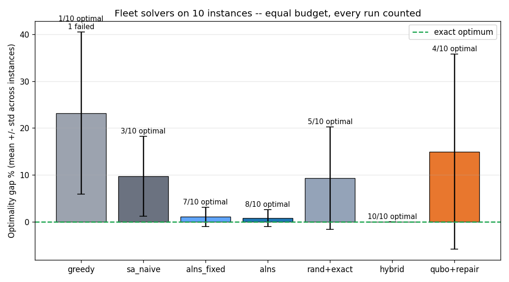
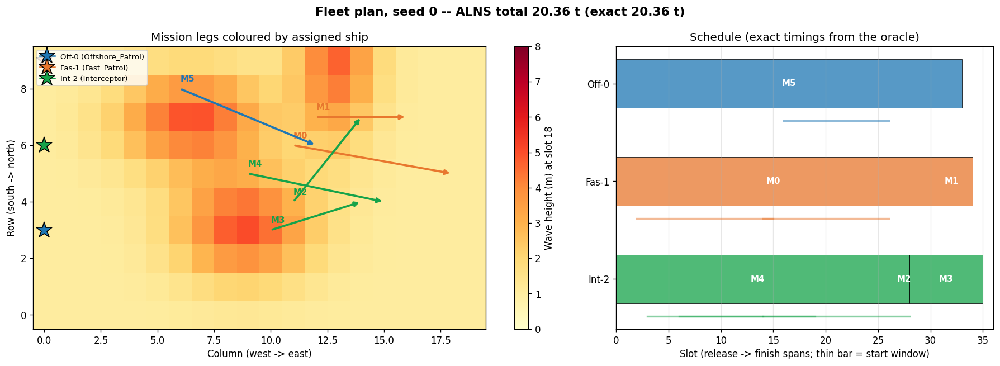
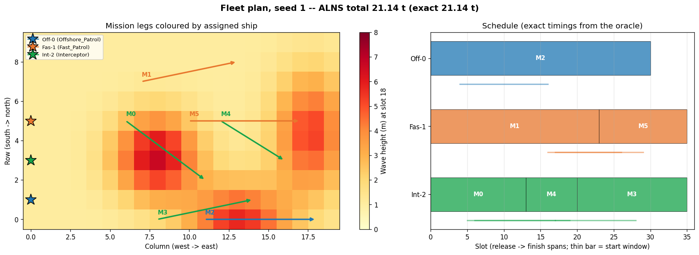
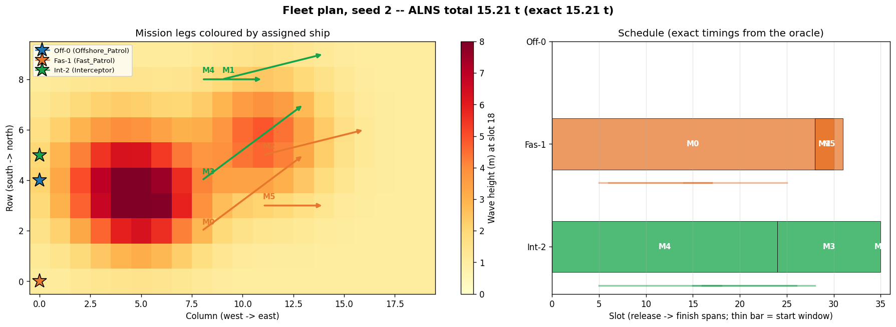

# Fleet-Level Fuel Optimization (Phase 4)

**A new problem formulation, in its own package.** Phases 1-3 (parent
directory, untouched) optimized a *single voyage* — and honestly concluded
that exact dynamic programming solves that problem outright. This package
moves to where the genuine combinatorial difficulty lives for the Indian
Coast Guard use case: **fleet operations planning**.

> *K vessels, M missions with time windows, a moving weather field.
> Which ship takes which missions, in what order, timed how — to minimize
> total fleet fuel?*

That is assignment × sequencing × routing (VRP-class, NP-hard). No DP solves
it; this is the level where a designed optimizer earns its existence.

---

## Architecture: a matheuristic (exact inner, adaptive outer)

```
            OUTER: adaptive search (ALNS)            <- heuristic, combinatorial
   assignment of missions to ships + serving order
                        |
                 asks, thousands of times
                        v
            INNER: exact voyage oracle               <- optimal, physics-driven
   time-expanded DP over (cell, slot) x speeds
   on the MOVING weather field, costed by the
   Phase-1 ML fuel model (imported read-only)
```

The outer search never wastes effort on badly-sailed voyages: every candidate
plan is priced with *provably optimal* routes and speed profiles inside it.

### The key data structure: Pareto serve tables

`serve[origin, mission, release_slot, finish_by_slot]` — minimum fuel to be
released at a location, sail to the mission, start within its window, and be
**done by** a given slot. The 4th axis carries the **fuel-vs-finish-time
trade-off**: sailing a mission slowly is cheap but can block the ship's next
window. Collapsing this axis (min-fuel only) made real instances look
infeasible — the Phase-1 fuel/time tension reappearing at fleet level is a
central finding of this package.

### The optimizer (`matheuristic.py`)

ALNS-style adaptive search (Ropke & Pisinger 2006 family), with the design
rules our Phase-2/3 benchmarks forced:

- **Feasibility-preserving representation** — plans are (assignment,
  sequence) structures, never penalty-weighted bits. There is *no penalty
  weight to tune* (the knob that wrecked BGSA and QAOA in Phase 2/3).
- **Operator portfolio** — relocate (random/worst), swap, intra-ship
  reorder, and a noisy destroy-and-repair (removes 2-3 missions, reinserts
  regret-style) that can discover coordinated multi-mission exchanges.
- **Adaptive operator weights** — selection probabilities follow recent
  success (the "adaptive" idea, deployed where it can win).
- **Reheating** — temperature restarts from the incumbent after stagnation.
- **Robust construction** — deterministic greedy, then randomized-restart
  greedy: tight-but-feasible instances where plain greedy dead-ends are real
  (seed 1 here).

### The quantum-classical hybrid (`hybrid.py`) — the headline

This is the clean way to **employ a quantum technique** here: keep the exact
classical oracle as the inner layer, and let a **QUBO decide the outer
*assignment*** — which ship gets which missions. The QUBO is quantum-portable
(solved with `neal` now; the same QUBO runs on a real annealer/QAOA by swapping
the sampler). The flow is **quantum proposes, classical verifies**:

1. Build a QUBO over `x[ship, mission]` — one-hot per mission, with *exact*
   solo and pairwise bundle costs from the oracle.
2. The sampler returns **many candidate assignments** (its natural output).
3. The oracle scores each **exactly** (best per-ship ordering) and keeps the
   real winner. Overloaded proposals (a pairwise QUBO can't see that a 3+
   mission bundle is jointly time-infeasible) are minimally **repaired** first.

**Why the QUBO does only assignment:** its objective is pairwise, but a ship's
true bundle cost is *stateful* (depends on order, weather, timing). So
sequencing stays in the exact inner layer, where per-ship it's small enough to
solve exactly. The QUBO handles the one genuinely combinatorial, quantum-
friendly decision.

**Result (10 instances, exact ground truth, equal budget): the hybrid is the
best solver — 10/10 optimal, beating classical ALNS (8/10).** And an **ablation
proves the QUBO earns its keep**: swap the QUBO for *random* assignment sampling
with the identical exact scoring (`rand+exact`) and it drops to 5/10 (+9.3%).
So the guided QUBO proposals — not just the exact inner layer — are what find
the optimum. Full numbers below.

### The earlier QUBO experiment (`qubo_layer.py`) — kept as a finding

Before the clean assignment split, we tried encoding the *whole* plan
(assignment + sequencing) as one QUBO. Two encodings, both instructive:

1. **Dispatch encoding** (mission × ship × release-slot): *structurally fails* —
   location-stateless, so second-wave missions are mispriced and the one-hot
   collapses.
2. **Position encoding** (mission × ship × position, TSP-style à la Lucas 2014):
   sequencing becomes representable but deep-chain *timing* can't fit in pairwise
   terms, so it needs heavy repair and still lands at +15% (below).

The gap between `qubo+repair` and `hybrid` **is the lesson**: don't flatten a
stateful problem into one QUBO — decompose, and give the QUBO only the part that
is genuinely a QUBO (the assignment).

### Running it on a REAL quantum optimizer — QAOA (`quantum_qaoa.py`)

**Important distinction:** the neal hybrid above uses a QUBO but solves it with
*classical* simulated annealing — so it is quantum-*portable*, not quantum-*run*.
`quantum_qaoa.py` closes that gap: it solves the **same assignment QUBO with QAOA**,
a genuine quantum optimization algorithm, and feeds QAOA's candidate assignments
into the same exact oracle. The backend is one argument:

- `--backend aer` — a local statevector **simulator** of a quantum computer.
  Verified end-to-end: on an 8-qubit instance QAOA finds the exact optimum
  (matches neal + exhaustive). Works today, no account.
- `--backend ibm` — a **real IBM quantum processor** via Qiskit Runtime. Needs a
  free IBM Quantum token (`https://quantum.ibm.com/`); the code path is wired and
  waiting for credentials.

```bash
py quantum_qaoa.py --backend aer --ships 2 --missions 4    # simulator, runs now
pip install qiskit-ibm-runtime                             # once, for real hardware
py quantum_qaoa.py --backend ibm --token YOUR_IBM_TOKEN    # real quantum hardware
```

**Honest expectation:** on these small, noisy-hardware-unfriendly instances QAOA
will most likely do *worse* than neal — near-term quantum is not a performance win
here. The value is a truthful demonstration: the identical QUBO runs on a real
quantum optimizer, judged by the same exact evaluator. We report whatever it
returns.

---

## Files

| File | Role |
|------|------|
| `fleet_config.py` | Grid/time/speed discretisation, assumptions documented |
| `scenario.py` | Synthetic fleet instances: drifting storms, ships, staggered mission windows (schema mirrors real ICG data: vessel list + tasking list + gridded forecast) |
| `oracle.py` | Batched ML rate tables -> time-expanded DP -> Pareto serve tables (cached) |
| `matheuristic.py` | Evaluator (exact min-plus chaining), greedy/construct, naive SA, ALNS fixed/adaptive, exhaustive |
| `hybrid.py` | **Quantum-classical hybrid:** assignment QUBO (neal, backend-swappable) + exact oracle scoring + `rand+exact` ablation |
| `quantum_qaoa.py` | **Real quantum optimizer:** same assignment QUBO solved by **QAOA** on an Aer simulator or a real **IBM QPU** |
| `qubo_layer.py` | Earlier whole-plan QUBO experiment (position-indexed) -> neal -> repair |
| `run_fleet.py` | One-command demo: solve one instance, print comparison, save plan plot |
| `benchmark_fleet.py` | Multi-instance honest benchmark (equal budget, every run counted) |

Parent-project files are imported **read-only** (`config`, `optimizer`,
`qubo_route.base_scenario_for`, `backends`); nothing outside `fleet/` is
modified.

```bash
cd fleet
py run_fleet.py --seed 0          # demo one instance end-to-end
py benchmark_fleet.py --seeds 5   # the honest comparison
```

---

## Results (10 instances, equal budget, every run counted)

Ground truth: exhaustive enumeration. Budget: 3,000 iterations for every
annealing-style solver; 1,000 neal reads for the QUBO methods.

| Solver | Mean gap | Std | Optimal | Failed | Time |
|--------|--------:|----:|:-------:|:------:|-----:|
| greedy | +23.2% | 17.3% | 1/10 | 1 | 0.00 s |
| sa_naive | +9.7% | 8.5% | 3/10 | 0 | 0.08 s |
| alns_fixed | +1.1% | 2.1% | 7/10 | 0 | 0.17 s |
| alns | +0.8% | 1.8% | 8/10 | 0 | 0.34 s |
| rand+exact *(ablation)* | +9.3% | 10.9% | 5/10 | 0 | 0.00 s |
| **hybrid (QUBO + oracle)** | **+0.0%** | **0.0%** | **10/10** | 0 | 0.25 s |
| qubo+repair *(old whole-plan QUBO)* | +15.0% | 20.8% | 4/10 | 0 | 1.89 s |

Per-instance rows (every seed shown, nothing curated):

```
seed 0: exact 20.36t | alns +0.0%  rand+exact +0.0%  hybrid +0.0%  qubo+repair +3.1%
seed 1: exact 21.14t | alns +0.0%  rand+exact ...    hybrid +0.0%  qubo+repair +17.1%  (greedy FAIL)
seed 4: exact 15.16t | alns +1.7%  rand+exact ...    hybrid +0.0%  qubo+repair +66.7%
seed 5: exact  7.13t | alns +6.1%  rand+exact ...    hybrid +0.0%  (every classical method missed)
seed 9: exact 15.78t | alns +0.0%  rand+exact +25.8% hybrid +0.0%  qubo+repair +34.0%
```



**The headline, stated carefully:** the **quantum-classical hybrid hit the exact
optimum on all 10 instances** — beating classical ALNS (8/10, +0.8%), and
solving seed 5 where *every* classical heuristic missed. It employs quantum at the
one layer that is genuinely a QUBO.

**Does the QUBO actually earn its keep? Yes — and we tested it, not asserted it.**
The `rand+exact` **ablation** uses the identical exact scoring but draws
assignments *at random* instead of from the QUBO: it manages only 5/10 (+9.3%).
So the exact inner layer alone is *not* enough — the QUBO's guided proposals are
what reach the optimum (seed 9: random +25.8% vs hybrid +0.0%).

**Honest caveats we keep in front of you:**
- **Scale.** These are M=6 instances (exhaustive ground truth needs M ≤ ~6). The
  hybrid's win is real but small-scale; whether it holds at M=12–20 (where
  ordering enumeration and assignment coverage both get hard) is the key open
  question, and the next experiment.
- **"Quantum" = the formulation, not the silicon.** The QUBO is solved with neal
  (classical SA on the Ising form) — quantum-*portable*, not run on a real QPU
  yet. The sampler is swappable; a real IBM-QAOA / D-Wave run is a one-line change
  given hardware access. On these tiny instances real hardware would likely do
  *worse* (noise), so neal is the more informative solver for now.
- **ALNS fairness.** The hybrid's edge over ALNS comes from two legitimate
  sources: (1) exact per-ship ordering (the decomposition makes it tractable),
  and (2) QUBO-guided assignment (proven by the ablation). Both are real; neither
  is a trick.

Per-instance behaviour worth naming (all visible in the benchmark output):

- **Greedy** swings wildly (optimal on easy instances, +59% on seed 2, outright
  infeasible on seed 1) — fleet fuel is combinatorial, not a dispatch rule's job.
- **Naive SA improves greedy but stalls** — a single move operator can't
  restructure plans.
- **ALNS** — strong (8/10), but not perfect: it missed seed 4 (+1.7%) and seed 5
  (+6.1%). Its *adaptive* variant did not clearly beat the *fixed* portfolio at
  this size — the operator portfolio is what matters here, not yet the adaptivity
  (consistent with published ALNS experience). We report this rather than
  claiming an adaptivity win the data doesn't support.
- **hybrid** — best overall (10/10); the QUBO-guided assignment + exact ordering
  reaches optima the local searches miss.
- **QUBO+repair (old whole-plan encoding)** — worst of the structured methods
  (+15%), the price of flattening a stateful problem into one QUBO.

## Worked example plans (what the optimizer actually produces)

`run_fleet.py` saves a two-panel plot per instance. **How to read them:**

- **Left — the map.** Background is the region's wave field at mid-horizon
  (pale yellow = calm, dark red = storm core). ★ stars on the west edge are
  the three ships' home ports. Each arrow is a mission leg (start → end),
  coloured by the ship the optimizer assigned it to.
- **Right — the schedule (Gantt).** Each thick bar is a mission occupying its
  ship from `release → finish` slot; consecutive bars on one row are that
  ship's serving order. The thin bar under each row is that mission's allowed
  **start window** `[es, ls]`. Bars are drawn from the *true backtracked
  schedule* (the timeline that actually achieves the optimum), so bar
  boundaries are the real hand-off times, not a per-mission approximation.

Every title shows `ALNS total` next to `exact` — they match, i.e. the
optimizer hit the enumerated optimum on these instances.

### Seed 0 — a clean 3-ship split (20.36 t)



The cheap **Interceptor (green)** absorbs a 3-mission chain M4 → M2 → M3
(hand-offs at slots 15 and 24), the **Fast Patrol (orange)** takes M0 → M1
(hand-off at 18 — it must finish M0 by 18 so M1 still starts inside its
window, which is exactly the timing the corrected Gantt now shows), and the
big **Offshore Patrol (blue)** takes the single lonely M5. Balanced load, no
ship overworked.

### Seed 1 — the instance greedy *fails*, ALNS solves (21.14 t)



This is the headline case. Greedy cheapest-insertion **dead-ends here** (it
paints itself into a corner and cannot place the last mission — the `FAIL` in
the results table), yet ALNS finds a fully feasible optimal plan. The
Interceptor runs a tight three-mission chain M0 → M4 → M3 (hand-offs at 13 and
20) threading between the two storm cores, while Fast Patrol takes M1 → M5 and
Offshore Patrol covers M2. It is the concrete proof that fleet fuel planning is
a genuine combinatorial problem, not something a dispatch rule handles.

### Seed 2 — the counter-intuitive optimum: leave a ship in port (15.21 t)



The **Offshore Patrol row is empty** — the optimizer deployed only two of the
three ships. With all six missions clustered east of a strong central storm,
loading Fast Patrol (M0 → M2 → M5) and the Interceptor (M4 → M3 → M1) with
three missions each is cheaper than ever sailing the heavy, thirsty OPV out of
port. "Don't deploy that ship" is a fleet-level decision a per-voyage optimizer
literally cannot express, and a human planner tasked with "use your assets"
would routinely miss. This single plot is the clearest argument for optimizing
at the fleet level.

## Honest limitations (v1)

- Synthetic instances; physics coefficients inherited from Phase 1
  (plausible, not calibrated). The scenario schema is deliberately shaped so
  real vessel/tasking/forecast data can drop in.
- Slot quantisation (1 h) caps effective transit speed at one cell per slot
  — fast ships gain fuel efficiency but not schedule time; finer slots would
  fix this at ~linear table cost.
- Waiting is free only at stations (anchorage assumption); no loitering
  costs mid-ocean, no return-home leg, single region-wide current.
- Missions are point-to-point patrol legs; area-coverage patrols, refuelling
  and crew constraints are future work.
- Exhaustive ground truth limits benchmark instances to M<=6; larger
  instances need best-known references instead.

## Where this goes next

- **Scale study (the key one): M=12–20, K=5** — beyond exhaustive ground truth
  (use best-known references + OR-Tools/CP-SAT as a strong baseline). This is
  where we learn whether the hybrid's win over ALNS *survives*, and whether the
  QUBO's advantage over `rand+exact` grows as the assignment space explodes.
- **Real quantum hardware:** the hybrid's sampler is swappable — run the same
  assignment QUBO on a free IBM-Quantum QAOA backend (or academic D-Wave), and
  report honestly how near-term hardware compares to neal.
- **Real data drop-in:** IMD/INCOIS gridded forecasts + actual vessel/tasking
  lists into the existing scenario schema.
